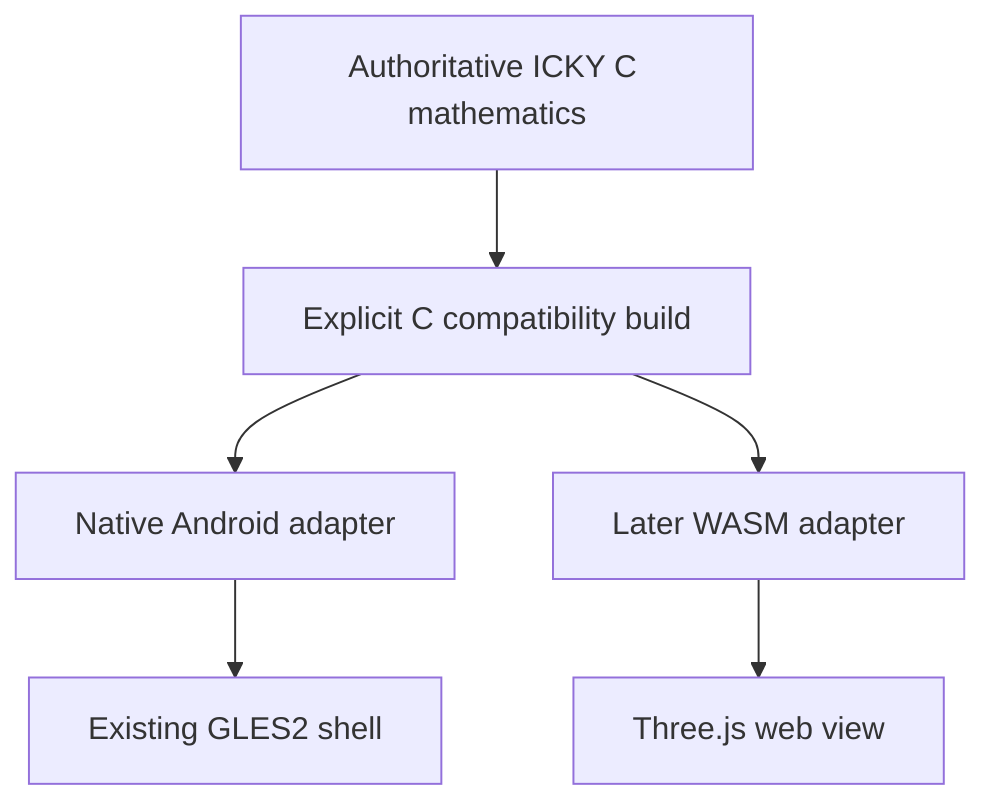

# Mostow: a visual and interactive system

**STAR M1 · 8 October 2026 · Planning and research result**  
Repository: `functorial-games/mostow`  
Status: architectural decisions and implementation specifications; no Mostow application, numerical realization, or device qualification is claimed by this report.

## 1. Decisions that subsequent jobs should inherit

Build a collection of short, connected mathematical encounters. A visitor should be able to manipulate a meaningful object immediately, then reveal the invariant, construction, or argument behind it. The motivating standard is a useful encounter with a mathematician who has minutes rather than time to read a paper. The complete proof remains accessible, but reading it is not an entrance requirement.

1. **Start with a living, ruffled, finite hyperbolic sheet in three-dimensional space.** Its intrinsic growth is the subject. Its particular spatial realization is not canonical.
2. **Start rendering with the existing NativeActivity/EGL/GLES2 machinery from Seifert.** Ordinary indexed triangles are sufficient. Add normals, lighting, orbit controls, and an animation clock; do not adopt an engine or rewrite packaging first.
3. **Use a fixed intrinsic piecewise Euclidean reference mesh approximating curvature −1.** Keep its metric separate from the current positions in three-dimensional space. The continuum approximation and the animation distortion are different errors and must have different labels.
4. **Bound every triangle's differential, not merely its edge lengths.** The moving abstract mesh must remain within a factor **1.10** of its reference intrinsic path metric at every time. Section 5 gives the quantity, construction, and all-time certificate. This is a bilipschitz bound on the abstract mesh, not a quasi-isometry claim about a finite object or an injectivity claim in ambient space.
5. **Generate continuous motion with a few smooth modes and an analytic amplitude bound.** No independent vertex noise, simulated wind, accumulating strain, or equilibrium as the defining experience. A preprocessing constraint solve may construct the starting realization; it is not the animation.
6. **Quotienting visibly joins formerly separate boundary pieces.** Paired colors, arrows, and names lead to one bright seam. Unzipping reveals two preimages. The synchronized universal cover explains the instructions after the gluing is intelligible.
7. **The closed genus-2 display is an explicitly schematic spatial realization.** Its hyperbolic metric lives in the intrinsic data. Do not claim a smooth isometric embedding of a closed negatively curved surface in ordinary three-dimensional space, or transfer the sheet's distortion certificate to a topology-demonstration morph.
8. **Dimension 2 stays central.** Fenchel–Nielsen length and twist changes preserve topology and curvature but change the marked hyperbolic structure. This is the deliberate counterpoint to Mostow rigidity.
9. **Put Tissot indicatrices in a dedicated distortion toy first.** A sparse optional field on the sheet is useful diagnostics, but perspective and folding make it a poor first explanation of quasiconformality.
10. **Use infinite spaces with explicit constants for quasi-isometry.** Start with integers in the real line and a block-coding map between two rooted trees. Add the surface-group orbit only with a proven generation/density construction.
11. **Use the regular ideal tetrahedron as the short route into the rigidity mechanism.** Keep polygons and general cells where they explain something better. A simplex is essential to the chosen volume argument, not to every screen.
12. **Preserve a cheap web option through a platform-free mathematical ABI.** A later WASM core plus Three.js frontend is worthwhile for URL sharing. Do not require it for the first Android slice.

The only substantial first-slice feasibility question is whether the proposed finite patch can obtain a visually useful spatial realization under the stated metric and phone budgets. That is an explicit numerical gate for the first Sun job, not a reason to reopen renderer, gluing semantics, or mathematical terminology.

## 2. Repository evidence and reuse

### 2.1 What exists

The inspected `mostow` revision is `123e6c89bbd381e6cfc32a6512e3f06f3b507ac4`. Its four files are:

- `books/hyperbolic-crochet.md`
- `books/images/README.md`
- `books/papadopoulos-quasiconformal.md`
- `books/mostow-rigidity.md`

All four were read. `books/images/README.md` supplies remote image references; the repository does not yet contain a renderer, application skeleton, or committed image collection. The crochet photograph was also inspected visually. No new implementation is inferred from a bibliography entry.

**Seifert's working source is not on its current main branch.** Main, `82d719af8ce8108d30e216dc1516142274fb67ff`, contains its introductory README. The useful snapshots are:

| Source | Exact inspected revision | Meaning |
|---|---|---|
| `functorial-games/seifert`, `feat/three-block-ribbons` | `eb1824cfb7acfd8344a03a0e399a6241e03f8724` | Working native slice |
| `functorial-games/seifert`, `style/functorial-icky-c` | `aea9528072bdf9f18dd4b2934e8708f242c81c8b` | Stacked source-style pass and explicit compatibility boundary |
| `functorial-games/spinor` | `830b4ceb6f029316cb53a5145fc6ac96eae21bd2` | Analytic deformation and geometry separation precedent |
| `isomorphismes/holomorphic` | `ce9d15e1c5cb2363201a61bbaa8eb10750ea1268` | Persistent, slowly changing mathematical state |
| `isomorphisms/catfood` | `609a9628d5a52860f956bf62e0914a0cd03292ae` | Device identities and paired application targets |
| `isomorphisms/flexible-pipes` | `c8cb7ac069a798eaf6cc228de9a2c23b2b351587` | Existing Android producer/preflight adapters |

The Seifert changes are [functorial-games/seifert PR #1, “Three orthant blocks, attached L-shaped ribbons and broader sticky touch”](https://github.com/functorial-games/seifert/pull/1) and [functorial-games/seifert PR #2, “Source-style pass: compositional ICKY C and explicit compiler boundary”](https://github.com/functorial-games/seifert/pull/2). Recheck their disposition at implementation time; copying from main today would miss the machinery. This plan does not request merging either change.

The inspected descriptions report earlier device installations. Those reports are not a new physical qualification, and they do not qualify a future Mostow build.

### 2.2 Concrete reuse map

Paths in this table are existing inspected repository paths. “Adapt” means carry over the proven responsibility while changing the application-specific portion; it does not mean introduce a common engine first.

| Classification | Existing source | Reuse decision |
|---|---|---|
| Reuse unchanged | Seifert `tools/normalize_icky_c.py`, `tools/test_normalize_icky_c.py` | Preserve the syntax-only ICKY C compatibility translation and its checks. Parameterize invocation paths if necessary; do not duplicate mathematics in generated C. |
| Reuse unchanged | `isomorphisms/android-NDK/apk/build-nativeactivity-apk.sh`, called by Seifert | Use the canonical NativeActivity APK packaging boundary. Resolve and record the exact external revision at build time. |
| Reuse unchanged | Flexible-pipes `scripts/run-android-apk-preflight`, `scripts/android-producer-stage`, `pipelines/android-apk-preflight.json` | Run the existing post-build producer checks on each artifact. These adapters are not themselves evidence of a two-device build orchestrator. |
| Adapt | Seifert `android/seifert_android.c` | NativeActivity, EGL lifecycle, input queue, pointer IDs, surface recreation. Replace angle state with Mostow state and add foreground animation scheduling. |
| Adapt | Seifert `android/seifert_renderer.c`, `android/seifert_renderer.h` | GLES2 shaders, buffers, depth and error handling. Add normal attributes, two-sided lighting, mutable position/normal uploads, and overlay passes. Keep static indices static. |
| Adapt | Seifert `android/seifert_view.c`, `android/seifert_view.h` | Shared draw/pick transformation and sticky touch ownership. Existing view is fixed affine yaw/pitch, not a ready orbit camera; existing picking is not triangle/seam picking. |
| Adapt | Seifert `native/seifert.h` | Checked C ABI style: explicit capacities, fixed-width indices, status results, caller-owned storage. Define Mostow types rather than reuse ribbon types. |
| Adapt | Seifert `native/test-host.sh`, `native/test_seifert.c` | Host-test pattern and strict build discipline. Geometry tests themselves must change. |
| Adapt | Seifert `android/build-native.sh`, `android/build-apk.sh` | Application/library names, geometry source inputs, checked symbols, canonical packaging. Retain API/ABI and signing discipline. |
| Adapt | Seifert `.github/workflows/apk-artifacts.yml` | Produce both A1 and C67 artifacts. Its inspected pull-request path filter omits source-style directories included by the push filter: include Mostow's actual mathematical and normalization inputs in both. |
| Adapt | Seifert `notes/icky-style.md`, `qualification/v02/README.md` | Explain the authoritative-source boundary and preserve evidence scope. Do not copy its frozen mathematical oracle as a Mostow implementation. |
| Reference only | Seifert `icky/seifert.c`, `types/Seifert.idric` | Compositional style and design notation. Ribbon mathematics is unrelated; the Idriç sketch is not a compiled qualification. |
| Reference only | Spinor `native/spinor_field.c`, `native/spinor_ribbons.c`, `notes/deformation-field.md` | Express deformation through invariants and analytic fields. Its radial rotation construction does not solve hyperbolic metric realization. |
| Reference only | Holomorphic `docs/random-holomorphic-deformation.md`, `android/app/src/main/cpp/holomorphic_walk.c` | Slowly evolving mathematical state, persistence, continuity. Do not import its candidate-search workers or color-objective machinery into a geometric metric constraint. |
| Reuse target facts | Catfood `android/application-targets.tsv`, `android/devices/miro-a1.md`, `android/devices/miro-c67.md` | A1 primary ARMv7, C67 paired ARM64. Device facts remain distinct from fresh physical receipts. |
| New | Intrinsic mesh, realization fixture, singular-value diagnostics, bounded motion modes | These are the first toy's actual mathematical contribution. |
| New | Orbit camera, triangle picking, geodesic overlay, seam correspondence, quotient/FN/QI/tetrahedron modules | Add as each slice needs them, behind the same small ABI. No scene-graph framework prerequisite. |

The A1 is the primary `armeabi-v7a` target: recorded Android 14, SC9863A, PowerVR GE8322. The C67 is the paired `arm64-v8a` target: recorded Android 14, MT6765/Cortex-A53, PowerVR GE8320. Do not substitute the TAB_P10 tablet's properties. Keep API 21 as the existing native build floor unless an actual new requirement changes it. Build tools remain on the producer, never on either phone.

Seifert already builds both ABIs and uses the established public test signer through the shared packager. Mostow should have its own application ID, proposed `org.isomorphisms.mostow`, and must not replace Seifert's installed package. Record source revision, compatibility-generator revision, NDK revision, signer certificate, APK digest, ABI, and preflight result for each artifact. Resolve external checkout revisions explicitly rather than inheriting floating references unnoticed.

## 3. Mathematical objects and interaction map

### 3.1 Vocabulary that must remain distinct

| Concept | Exact meaning used here | What a picture alone cannot establish |
|---|---|---|
| Isometry | A bijection preserving the specified intrinsic distances exactly; without surjectivity, an isometric embedding | Bending a drawing does not demonstrate or refute it. |
| Local conformality | The differential is a positive scalar times an orthogonal map, at regular points; orientation handled separately | A conformal map may change lengths and area substantially. |
| Bilipschitz identity between mesh metrics | For every pair of abstract mesh points, `(1/L)d_reference ≤ d_current ≤ L d_reference` | Small edge errors alone do not bound all triangle directions. Ambient self-crossings do not identify mesh points. |
| Quasiconformal map in dimension 2 | An orientation-preserving homeomorphism in `W¹,²_local` with `σ_max² ≤ K det(Df)` almost everywhere; at nonsingular points this is `σ_max/σ_min ≤ K`. Use metric-orthonormal coordinates on surfaces. | Bounded anisotropy does not bound absolute scale. Orientation reversal is handled by composing with a reflection. |
| Quasi-isometry | `(1/L)d(x,y) − A ≤ d′(f(x),f(y)) ≤ Ld(x,y) + A`, plus every target point lies within a stated `B` of the image | The inequalities alone define a quasi-isometric embedding; coarse surjectivity matters. A finite viewport is not the underlying infinite space. |

For the sheet, the piecewise affine identity between two metrics on the same abstract disk has a well-defined facewise distortion even when its map into three-dimensional space intersects itself. Calling the spatial image a quasiconformal homeomorphism would then be wrong. Label its diagnostics “local metric anisotropy” and explain the abstract-surface interpretation.

### 3.2 Recommended encounter order

The main learning path is **living sheet → gluing/genus 2 → changing hyperbolic structure → local distortion → coarse maps → boundary → ideal volume → rigidity**. These are linked encounters, not prerequisites enforced by a menu.

Provide a short “Why dimension three?” route directly to **ideal triangles versus ideal tetrahedra → regularity under boundary maps → rigidity argument**, with links back to gluing and coarse maps. This serves the original short-visit purpose. Implementation order need not match either reading order: the tetrahedron is relatively independent and worth building early.

| Toy | What is visible | What is manipulable | Mathematical quantity | Intended understanding |
|---|---|---|---|---|
| A. Living hyperbolic sheet | Ruffled finite disk; optional intrinsic rings, triangulation, and marked paths | Orbit, pinch zoom, pause, measure two points, toggle diagnostics | Curvature −1 target; circumference/area growth; reference distances; current singular-value bounds | Intrinsic excess circumference produces spatial folding, but a particular fold is not the hyperbolic plane's unique shape. |
| B. Quotient as gluing | Open octagon with named paired edges; edges meet in space and become bright seams | Select a pair, scrub joining, inspect a seam, display its two preimages | Side-pairing equivalence relation; quotient vertex/edge classes; topology | Formerly separate pieces become one locus. |
| C. Genus-2 structure and cover | Closed schematic surface linked to its cut polygon and nearby cover cells | Cross a seam, track a point, reveal a word/action; unzip a seam visually | Octagon relator, holonomy, Euler characteristic, hyperbolic area | The cover records gluing instructions; seams are not physical singularities of the hyperbolic metric. |
| D. Surface flexibility | Same pants decomposition/topology with cuff lengths and twist marks | Change one length or twist; compare marked closed curves | Three positive lengths and three real twists; curvature −1; area `4π` | Same genus and area do not determine a hyperbolic surface. Folding a picture and changing its metric are different operations. |
| E. Local distortion | Input circles and output ellipses, axes, scale/area readouts | Drag anisotropy and uniform-scale controls; select a point | Two singular values, `K`, determinant/area ratio | Conformal, isometric, area preserving, and bilipschitz are distinct. |
| F. Coarse geometry | Integer line/real line; two word trees; later an orbit graph in H² | Pick pairs, expand the viewport, inspect paths and nearest image points | Proven `L,A,B`; actual pair distances; boundary prefixes | Additive error and coarse surjectivity have concrete meanings that persist as the viewport grows. |
| G. Boundary at infinity | Rays, finite truncations, and limiting boundary points | Move basepoint, extend rays, compare images under a coarse map | Finite Hausdorff equivalence of rays; induced boundary homeomorphism in the stated setting | A coarse map can determine fine boundary data without being an isometry. |
| H. Ideal shapes and volume | Ideal polygons, tetrahedron, optional convex cell | Drag ideal vertices; normalize one to infinity; compare decompositions | Cross-ratio, dihedral angles, ideal volume, regular maximum | Ideal triangles hide flexibility that ideal tetrahedra can detect. |
| I. Rigidity mechanism | Linked boundary triples/tetrahedra, volume deficits, and a compact proof map | Apply a Möbius map or a nonconformal boundary deformation; inspect a family of tests | Maximal-volume preservation forced by the global hypothesis | The lattice/manifold hypothesis forces a special boundary map; arbitrary quasi-isometries do not. |

A quotient seam, intrinsic geodesic, triangle edge, and distortion glyph need different visual styles. A legend appears beside the current object, not on an introductory lecture screen.

## 4. Renderer and program architecture

### 4.1 Renderer decision

| Candidate | Fit for this work | Decision |
|---|---|---|
| Existing GLES2 | Already has native Android lifecycle, packaging, depth-tested indexed triangles, and checked C boundaries. Needs lighting, orbit, continuous redraw, and triangle picking. | **First renderer.** Smallest route to the actual mathematical object on A1. |
| Sokol | Good small-C graphics abstraction and consistent with other graphics experiments. Current `sokol_gfx.h` exposes GLES3, not a GLES2 drop-in backend. Still requires platform and shader integration. | Revisit only for a demonstrated multi-platform need. Do not replace a working shell to obtain facilities the first toys do not need. |
| raylib | Convenient mesh, camera, input, and platform APIs, with C integration. | Capable, but duplicates already working lifecycle/input/package responsibilities. No first-slice advantage large enough to justify migration. |
| Three.js | Indexed `BufferGeometry`, normal/custom attributes, camera controls, mesh ray picking, lighting, and shaders suit these objects. | **Preferred later web frontend** over a WASM mathematical core. Current WebGLRenderer requires WebGL2; do not promise the A1 browser path without checking it. |
| p5.js | Modern, maintained creative coding; can construct triangle geometry and WebGL sketches. | Useful for small explanatory sketches, but Three.js is a better fit for arbitrary meshes, mesh picking, seam overlays, camera handling, and explicit WASM buffers. |
| Processing.js | Archived older Java-to-JavaScript-era project, distinct from p5.js. | Not a new-project option. |

Use rasterization. Picking rays are geometric queries, not a ray-traced renderer. Ray tracing could later produce more expensive shadows, reflections, or a deliberately intrinsic hyperbolic-camera experiment; none is required to understand this sheet, quotient, or tetrahedron. It would not certify the metric, solve gluing, remove self-intersection, or supply the boundary argument. Soft two-sided lighting and depth-tested lines are sufficient first.

### 4.2 Small, explicit boundaries

The authoritative mathematical source is clear, compositional ICKY C where the established compatibility subset permits it. Follow Seifert's syntax-only normalization into ordinary C for the NDK. Generated compatibility C is a build product, not a second mathematical implementation. A future direct Ick compiler build may replace that boundary after qualification; its absence must not block this project.

Use descriptive types and functions for intrinsic points, reference triangles, current positions, pairings, and diagnostics. Avoid a universal geometry object or generalized plugin architecture. Proposed new locations, **not existing paths**, are `icky/mostow_sheet.c`, `native/mostow.h`, `native/test_mostow_sheet.c`, and Mostow-named adaptations under `android/`. Split later toys into separate small mathematical modules when they arrive.

The ABI exposes opaque or explicitly versioned state, fixed-width IDs, caller-provided buffers/capacities, and checked error results. Mathematical code contains no EGL, JNI, Android, DOM, or renderer objects. Use double precision for intrinsic construction/certificates and float positions for rendering; include float conversion in the final distortion check. Assert layouts, capacities, and index limits on both ABIs. Keep first meshes below 65,536 vertices so GLES2 unsigned-short indices need no extension.

Separate immutable topology/reference metrics from current position/normal arrays. Upload indices and reference annotations once, update only moving arrays. Keep GPU calculations unnecessary to the mathematical certificate. The same kernel can later be compiled to WASM and feed Three.js typed arrays; neither frontend sits underneath the other.

This preserves the option to send Dror a URL without paying for two frontends now. A source/parameters link beside each eventual web toy should expose its mathematical definitions, exact fixture version, and compact reproducible state. Browser rendering does not replace the shared mathematical implementation.

## 5. The living sheet: implementable geometric proposal

### 5.1 What the annular and crochet constructions actually say

Henderson and Taimiņa describe Thurston's construction by attaching annular paper strips: the inner edge of one meets the longer outer edge of another. With strip width `δ` and inner radius `r`, the length ratio is `(r + δ)/r`. In the thin-strip limit, repeated ratios become exponential. With growth-coordinate `s`, the limiting local metric is

`ds² + exp(2s/r) du²`, with Gaussian curvature `−1/r²`.

These are horocyclic/parallel rows. They are not the concentric geodesic circles about a center. Crochet's repeated stitch-increase rule realizes a discrete growth ratio; stitch shape, yarn, and tension make the physical model approximate. Neither paper nor crochet selects one canonical spatial embedding. [S1–S3]

For a disk centered at a point, the appropriate exact target is instead

`dr² + sinh²(r) dθ²` for curvature −1.

Its circumference is `2π sinh(r)` and its area is `2π(cosh(r) − 1)`. The first mesh uses these radial annuli because they give a center, distance rings, and an intuitive growth comparison. Its connection to crochet is the addition of material as rows expand; it is not presented as a literal discretization of Thurston's horocyclic strips. A later “rows” switch can show the exponential horocyclic construction using the same metric machinery.

**Do not generate the reference by attaching seven equal Euclidean triangles at every interior vertex and merely shrinking them.** The angle excess remains 60 degrees per vertex. That construction is a useful combinatorial negatively curved model, but it is not a convergent refinement of a fixed smooth curvature −1 metric. Henderson and Taimiņa explicitly discuss this distinction. [S1]

### 5.2 Intrinsic discretization

Choose a finite target disk of radius **2 curvature units**. Then circumference is about 22.79, versus 12.57 for a Euclidean radius-2 circle, and area is about 17.36. Those figures make the growth visible without requiring a huge patch. Radius expansion is a later feature; do not start by promising an unbounded physical realization.

1. Form geodesic-radius rows `r_j = j h`, ending at radius 2, with initial target spacing `h` around 0.12–0.15. Set row population approximately `ceil(2π sinh(r_j)/h)`; use one central vertex and a regular first ring. Stagger row phases deterministically.
2. Place the intrinsic vertices on the hyperboloid: `(cosh r, sinh r cos θ, sinh r sin θ)`. Store this coordinate as intrinsic data, not as the displayed position in three-dimensional Euclidean space.
3. Join adjacent rings by a monotone angular zipper triangulation. Test triangle quality, then perform intrinsic Delaunay flips and, where needed, deterministic local refinement. Treat a minimum angle near 20 degrees and bounded edge aspect ratios as meshing targets; reject slivers rather than hoping edge checks will detect their directional distortion.
4. Calculate each reference edge's exact hyperbolic length from the Lorentz inner product, using a numerically stable small-distance formulation. Retain double precision.
5. Replace each hyperbolic triangle by its **Euclidean comparison triangle with the same three side lengths**. These glued flat triangles define the fixed piecewise Euclidean reference metric used by the animation certificate.
6. Keep the true hyperbolic coordinates and geodesic edges alongside the comparison metric. The boundary is a geodesic polygon approximating the radius-2 disk, not an exact geodesic circle. A ring overlay sampled from the target circle must be identified separately from the polygonal boundary.

Target roughly 2,000–4,000 vertices and at most 8,192 triangles for the first device fixture, with a firm first-slice budget of 4,096 vertices. The exact mesh count follows from quality-controlled generation; it is not a claim about an already generated fixture.

There are now three separate objects: the smooth hyperbolic target, its piecewise Euclidean reference approximation, and a time-dependent spatial realization. The metric certificate below relates the last two. It does **not** silently certify a 10% approximation to the smooth hyperbolic plane.

### 5.3 Data model

| Entity | Intrinsic/topological data | Spatial/display data |
|---|---|---|
| Vertex | Stable ID; intrinsic hyperboloid coordinate; ring/angle provenance; quotient class when applicable | Base position; current float position; three mode vectors; derived normals |
| Edge/halfedge | Endpoint IDs; incident faces; exact target length; boundary flag; directed pairing ID if any | Overlay style; selected state; no independent geometry inconsistent with its vertices |
| Triangle | Oriented IDs; comparison coordinates; inverse reference matrix; target hyperbolic area; adjacency | Current Jacobian/Gram matrix; singular values; area normal; culling bounds |
| Seam | Two directed halfedge chains; orientation reversal; common arclength parameter; point correspondence; quotient IDs; gluing state | Shared displayed curve; duplicate cut-side curves; bright stroke and pick proxy |
| Marked point | Face ID and barycentric coordinates, or exact intrinsic coordinate with a recorded face location | Evaluated position at the current time; never a freely drifting screen point |
| Path | Intrinsic endpoints and sampled crossings through reference faces | Samples advected with those faces; optional length comparison |

The quotient topology is independent of the rendering vertex buffer. Sharp normals or UV boundaries can duplicate render vertices without duplicating mathematical points. Conversely, two intersecting triangles do not become adjacent because their coordinates coincide.

### 5.4 Initial spatial realization

Use a **deterministic host-side continuation and constraint solve** to produce an accepted base fixture. This is proposed numerical work, not an established successful realization.

1. Start from a coarse intrinsic mesh and a smooth, nonplanar seed made from a few low-frequency scalar mesh modes in three coordinate directions. Remove constant modes and fix rigid-motion freedom with a small anchor frame. Do not prescribe ruffle centers or insert independent random displacements.
2. Continue the target edge metric from the corresponding flat disk toward curvature −1. At each step solve the edge-length/face-metric residuals with a sparse damped Gauss–Newton or equivalent constrained least-squares method. Use normalized residuals and inspect facewise singular values, not just the aggregate objective.
3. Refine intrinsically, interpolate the previous spatial realization, and continue the solve. Excess circumference and the metric constraints determine where folding develops. The algorithm may choose among many realizations; none is presented as geometrically privileged.
4. Accept only if every comparison triangle has base singular values in `[1/1.04, 1.04]`, no face collapses, and the chosen starting view visibly exposes the sheet's growth rather than hiding it in an opaque knot of intersections.
5. Bake the accepted reference mesh, base positions, mode data, and certificate as a versioned fixture. Keep the generator's source, parameters, convergence history, worst face, and artifact digest beside the output. The device does not need a sparse solver.

Energy minimization is a numerical initialization technique here, not the explanation of the object or its continuing behavior. There is no claim that a physical equilibrium represents H². Do not add a cloth/wind simulation to make the resulting fixture move.

If the radius-2 mesh cannot meet the base bound within the first phone budget, the Sun job should report the concrete failed configurations and resulting singular-value extrema. It may refine or change the smooth seed/continuation within scope. It must not quietly loosen the bound, substitute an arbitrary ruffled disk, or shrink the patch until the hyperbolic growth becomes imperceptible. That numerical result would justify a targeted follow-up decision.

### 5.5 Precisely measured distortion

For one reference face, choose flat comparison coordinates

`q₀ = (0,0)`, `q₁ = (length₀₁,0)`, `q₂ = (a,b)`,

where `a = (length₀₁² + length₀₂² − length₁₂²)/(2 length₀₁)` and `b = sqrt(length₀₂² − a²)`.

Let `Q = [q₁−q₀, q₂−q₀]`. At time `t`, let the displayed face's edge matrix be `E(t) = [X₁(t)−X₀(t), X₂(t)−X₀(t)]`. Its differential is the 3-by-2 matrix

`J(t) = E(t) Q⁻¹`.

The two singular values of `J` are the square roots of the eigenvalues of its 2-by-2 Gram matrix `JᵀJ`. They measure the smallest and largest local stretch relative to the reference triangle, in **all** tangent directions.

- Local anisotropy: `K_face = σ_max / σ_min`.
- Local area ratio: `σ_max σ_min`.
- Whole-mesh length factor: `L_mesh = max_faces(max(σ_max, 1/σ_min))`.

Use stable symmetric-eigenvalue evaluation, explicit finite/degenerate checks, and conservative numerical margins. Edge-length ratios are useful debug values, not a replacement for these tests.

The implementation contract is `L_mesh ≤ 1.10` **for all time**. Since every curve is assembled from face segments, integrating these local inequalities bounds every curve's length. Taking infima gives

`(1/1.10) d_reference(p,q) ≤ d_current(p,q) ≤ 1.10 d_reference(p,q)`

for every pair of points of the same abstract mesh, using paths within that patch. The proof remains valid when the spatial image self-intersects, provided crossing triangles do not become traversable shortcuts. Between two arbitrary animation poses the immediately available bound is `1.10² = 1.21`, not automatically 1.10.

This is stronger and more informative than a quasi-isometry label for a compact patch. On a bounded space a sufficiently large additive constant can make a coarse inequality nearly vacuous. Quasiconformal anisotropy alone would also be insufficient: uniform expansion has `K = 1` while changing every distance.

### 5.6 Slow motion with an all-time certificate

Use three smooth vector fields `W_j` on the fixed mesh and define

`X_vertex(t) = X_base_vertex + Σ a_j sin(ω_j t + φ_j) W_j(vertex)`.

Candidate fields are low-frequency intrinsic Laplacian modes multiplied by spatial directions, or smooth long-wavelength ambient fields sampled at the base positions. Remove the purely rigid component. Choose deterministic modes that move separated folds coherently; no per-vertex noise. Initial periods around 48, 67, and 91 seconds give slow nonrepeating-looking motion without a jitter generator.

For each face compute `D_j = [W_j(vertex₁)−W_j(vertex₀), W_j(vertex₂)−W_j(vertex₀)] Q⁻¹`. Scale amplitudes so that

`max_faces Σ |a_j| ||D_j||₂ ≤ 0.035`.

Reserve a further 0.005 for verified numerical/quantization error, making the total conservative perturbation allowance at most 0.04. Singular-value perturbation then yields

`σ_min(t) ≥ 1/1.04 − 0.04 ≈ 0.92154`,  
`σ_max(t) ≤ 1.04 + 0.04 = 1.08`.

Thus `L_mesh < 1.086`, leaving room below the public cap of 1.10. The public cap is an acceptance requirement, not a knob the user can accidentally exceed. The sum-of-operator-norms certificate covers every phase combination, not merely sampled frames. If float conversion or another implementation approximation exceeds the reserved margin, reduce amplitudes or fix the computation; do not conceal it in the label.

For the machine-level bound, clamp each evaluated scalar mode coefficient to its certified amplitude interval. The geometry certificate then does not depend on a particular library's sine accuracy. Bound the remaining multiply/add and float-conversion error from the finite coordinate/amplitude ranges, propagate it through each fixed `Q⁻¹`, and store the worst resulting derivative-error bound. Avoid compiler options that invalidate those arithmetic assumptions. Frame sampling is a useful regression check, not the all-time proof.

Show the measured current `L_mesh` and maximum `K_face` when diagnostics are open. A coarse implication is `K_face ≤ 1.10² = 1.21`, but the actual measured anisotropy is more informative. Do not label the coefficient amplitude or displacement magnitude as “K.”

Evaluate positions directly from absolute active-animation time. Do not integrate incremental deformations, which can accumulate drift. Pause the active clock when backgrounded; restore phase without a jump. Let the visitor pause while measuring, but the default foreground experience remains alive. Do not use camera motion as a substitute for nonrigid deformation.

The final fixture must show a visible nonrigid change over a 20–30 second observation. Compare two poses after fitting out rigid motion, and inspect separated landmarks on the actual phone. If the mathematically safe amplitudes are visually negligible, improve the coherent fields rather than replacing the metric test with an aesthetic score.

### 5.7 Normals, intersection, paths, and legibility

Use triangle cross products for face normals and angle-weighted or area-weighted averages on each connected vertex star. Default to smooth shading with deliberate crease splitting at severe folds; offer flat shading to expose the mesh. Normals are rendering data, not the target hyperbolic normal field.

Use two-sided lighting, front/back distinction by restrained tone, a neutral material, and a soft directional plus ambient light. Disable face culling; orient the lighting normal appropriately for the visible side. Avoid specular glare that conceals the intrinsic grid. A subtle ring/grid overlay should expose material growth without turning every triangle into a bright wire cage.

**Accept self-intersection as an extrinsic artifact in the first slice.** Detect and report nonadjacent triangle intersections in host diagnostics where practical; show an optional intersection highlight. Do not add collision physics as a prerequisite. Reject a visually unreadable default view, but do not imply that this constitutes a proof of embeddedness. The abstract metric/topology remains unchanged at a crossing. Later sheet realizations can discourage intersections, at a stated computational cost, without redefining H².

Geodesic endpoints belong to intrinsic coordinates. Compute the target hyperbolic geodesic, locate its pieces in the intrinsic triangulation, and map the samples barycentrically onto the current surface. Label its displayed length carefully: target hyperbolic length and reference-mesh length are distinct. A line that looks bent in space may still represent an intrinsic geodesic. For a reference-mesh shortest path use an actual polyhedral shortest-path method or explicitly label an edge-graph approximation; Dijkstra on mesh edges is not silently an exact surface geodesic.

Fix the target-to-mesh interpolation convention: use straight-sided Klein coordinates for intrinsic triangle location and barycentric display interpolation, deriving them from the stored hyperboloid coordinates. This is an internal correspondence convention; it does not turn affine Klein coordinates into a hyperbolic metric or make the display interpolation exactly isometric.

First-slice picking may use a CPU triangle ray test against the current positions. A few thousand faces do not justify a picking engine before profiling. Both drawing and picking use the same camera matrices. One finger on the background orbits; two fingers pinch; an explicit measure mode reserves point selection. Preserve Seifert's pointer-ID ownership so a second finger does not steal the first gesture. Controls and seam handles need approximately 48 dp touch targets, not a copied fixed pixel radius. Enlarged invisible hit regions must not merge nearby seams ambiguously.

### 5.8 Host-verifiable facts

Host tests can check topology and orientation, triangle quality, target distance formulas, target angle sums at interior vertices, exact hyperbolic polygon area, PL curvature deficits, reference matrices, base singular values, the analytic mode bound, float-output distortion, normal finiteness, mesh capacities, lifecycle-independent state evolution, and deterministic fixture reproduction.

For approximation fidelity, compare meshes at `h` and `h/2`: hyperbolic target area versus PL area, selected radial/tangential distances, and integrated PL angle defects versus negative area away from the boundary. Include boundary turning in Gauss–Bonnet. Record convergence rather than pretending that mesh refinement alone is a certified continuum error estimate. First-release annotations must state “motion bound relative to the reference mesh.”

These tests do not establish aesthetic legibility, touch comfort, sustained A1 performance, or absence of all self-intersections. Those have separate visual/device evidence requirements.

## 6. Gluing and dimension-2 flexibility

### 6.1 One quotient encounter, with increasing depth

Merge the proposed “quotient” and “genus-2” toys into one staged encounter. A rectangle-to-cylinder demonstration can be a ten-second optional entry, but should not become another standalone development project. The main object is a standard regular hyperbolic octagon with angles `π/4` and cyclic boundary word

`a b a⁻¹ b⁻¹ c d c⁻¹ d⁻¹`.

Pair corresponding sides with reversed boundary traversal. All eight corners become one quotient vertex. The resulting cell structure has one face, four edges, and one vertex, giving Euler characteristic `1 − 4 + 1 = −2`, hence an oriented genus-2 surface. The octagon area is `(8−2)π − 8(π/4) = 4π`. Its eight corner angles sum to `2π` at the quotient vertex, so the vertex is not a cone singularity.

Each pair has two visible preimage chains with the same stable identity, arrow direction, and normalized arclength coordinate. Selecting one highlights its partner immediately. During joining, display the two chains converging onto a common curve. At completion, retain a bright, depth-tested seam with a short label such as `a`. Display `x ~ γx` as the inspectable algebraic explanation of that particular identification.

A reliable spatial construction starts from a known triangulated topological genus-2 surface with a chosen cut graph. Cut it into a disk whose boundary is the octagon word, retaining duplicate boundary vertices and their quotient IDs. Construct the opening morph on this correspondence and play it in reverse for gluing. This avoids trying to invent arbitrary independent edge trajectories that cannot meet consistently. It is a topology display mesh associated with the intrinsic polygon, not a metric realization of the octagon. Self-intersections during the explanatory morph are allowed and should remain visually intelligible.

A scrubbed joining animation is a demonstration of an identification; it need not manufacture a mathematically changing quotient at every intermediate frame. Commit the logical pair identification when the pair is complete. Show progressive pair completion without claiming an intermediate spatial contact is a new topological operation.

“Inspect seam” temporarily separates the two rendered cut sides while retaining the same quotient object. If a future control actually cuts the surface, call it “cut,” and change the topology explicitly. Avoid a button whose displayed unzip silently changes the meaning of the metric or group action.

Use screen-width mesh ribbons or camera-aware strips for seams; GLES2 wide-line support is not a reliable basis for touch-sized strokes. Keep the visible seam attached to the same canonical curve used for picking. Use names and arrows as well as color, especially where several seams meet. Hidden seam portions may have an optional dashed ghost, clearly distinguished from visible surface geometry.

### 6.2 The synchronized cover

The polygon/cover view is a secondary panel or swipe, not the opening identity of the project. In it, side-pairing isometries explain why a crossing returns to the corresponding point of the fundamental region. Construct each side pairing from the endpoint correspondence and the correct inside/outside orientation, and verify its action numerically. Use a documented hyperboloid or PSL(2,R) representation internally.

Verify the relator `[a,b][c,d] = 1` in that representation, up to the chosen numerical tolerance and the projective sign convention. Track a marked point through a seam in both views. Tile only the required neighborhood; deduplicate cells by their actual group action/cell identity, not merely by different words. Surface-group Cayley graphs contain cycles and relations: a word tree is not automatically the Cayley graph.

The bright seam records where the model was cut and glued. It is not a place where the closed hyperbolic metric becomes singular. Let users hide seams after inspecting them, then restore them without losing correspondence.

### 6.3 Fenchel–Nielsen deformation

Use a pants decomposition of the genus-2 surface: two pairs of pants joined along three cuffs. The marked hyperbolic structure has three positive cuff lengths and three real twists. Choose a default such as lengths `(1.5, 1.5, 1.5)` and twists `(0,0,0)`; these are design parameters, not a claim that the regular-octagon metric has these coordinates.

Construct each pair of pants from two right-angled hyperbolic hexagons. For cuff lengths `ℓ₁, ℓ₂, ℓ₃`, the perpendicular seam between cuffs 1 and 2 satisfies

`cosh(distance₁₂) = [cosh(ℓ₃/2) + cosh(ℓ₁/2) cosh(ℓ₂/2)] / [sinh(ℓ₁/2) sinh(ℓ₂/2)]`.

This supplies computable geometry, not a decorative tube resize. Start with one cuff-length slider over a compact safe interval, for example 0.75–3, keeping the other five parameters fixed. Then add one twist slider measured in arclength along its cuff. A twist of one cuff length changes the marking by a Dehn twist; distinguish marked Teichmüller coordinates from the unmarked moduli point.

Always display the changed cuff's actual geodesic length and the unchanged curvature and total area `4π`. Later show the length of a transverse marked curve to make a twist observable. Avoid claiming a numerically chosen comparison map is the extremal Teichmüller map unless that optimization has actually been established.

The regular-octagon presentation and a pants presentation can coexist without pretending they are the same default metric. Moving between them requires either computing the conversion or naming the selected metric explicitly. Do not interpolate holonomy matrices and assume the result still satisfies the surface relation.

## 7. Local distortion and coarse geometry

### 7.1 Tissot as a dedicated, exact toy

Papadopoulos's treatment of Tissot makes the differential, its principal directions, and its ellipse the natural central interaction. [S4] Begin with a map whose quantities are exact:

`f(x,y) = rotation · diag(λ exp(a), λ exp(−a)) · (x,y)`, with `λ > 0`.

Show input circles, output ellipses, axis directions, and numbers:

- singular values `λ exp(|a|)` and `λ exp(−|a|)`;
- dilatation `K = exp(2|a|)`;
- area ratio `λ²`.

Dragging `a` changes anisotropy; dragging `λ` changes scale without changing K. Presets make the distinctions immediate: uniform doubling is conformal but not isometric; `diag(2, 1/2)` preserves area but has `K = 4`; a rotation is isometric.

Next, use radial stretch `f(r exp(iθ)) = r^α exp(iθ)`, `α > 0`, away from its exceptional origin. Its radial and tangential stretches have ratio `max(α,1/α)`. It is a quasiconformal plane homeomorphism, yet for `α ≠ 1` it is not globally bilipschitz on the plane. On a displayed annulus one can separately report finite absolute stretch bounds. This is a useful antidote to treating all distortion words as synonyms.

On the moving sheet, offer at most a sparse initial field of about 12–24 glyphs. Compute the ellipse from the reference-to-current face differential. Add a tangent-plane inset or numeric axes when selected, since screen perspective can make even a metric circle appear elliptical. Color may encode `log K` with a fixed labeled scale; it must not encode arbitrary “deformation energy.” Area ratio needs a separate readout or optional scale.

### 7.2 Integers and the real line

Use the inclusion `i: ℤ → ℝ`, with ordinary distance on both spaces. It preserves all distances: `L = 1`, `A = 0`. Every real point is within `B = 1/2` of an integer, so it is a quasi-isometry, not merely an embedding.

Show the nearest-integer coarse inverse with a documented tie convention. For real `x,y`, rounding changes their distance by at most 1, so the reverse map has `L = 1`, `A = 1`, and is onto the integer vertices. Allow arbitrary pan/zoom and picked pairs. The formulas and constants are for the infinite spaces; the viewport is only a window.

The UI should distinguish the distortion inequality from the density strip. Setting `B` below 1/2 visibly fails at half-integers. This teaches a part of the definition often omitted by pictures.

### 7.3 Two bushy trees with explicit constants

Use rooted 4-ary and rooted binary trees with **vertex sets** carrying unit-edge graph distance. A vertex in the first tree is a finite word in `{00,01,10,11}`. Map it to the binary word obtained by concatenation. Do not call these unrooted regular trees: their roots and other vertices have different degrees.

If two source words have common prefix length `k` in two-bit blocks, their binary images share either `2k` or `2k+1` initial bits before diverging; prefix cases have no extra bit. Consequently

`2 d_source − 2 ≤ d_target ≤ 2 d_source`.

The conventional quasi-isometry definition is satisfied by `L = 2`, `A = 2`. Every even-depth binary vertex is in the image and every odd-depth one lies one edge from the image, so `B = 1`. State that the map and constants here concern vertex metrics. Extending it over continuous edges requires separately handling overlapping initial half-paths; do not silently change the domain.

Pick two source vertices and highlight both geodesics; show the shared prefix, exact distances, and inequality. Let the user try a smaller proposed additive constant and reveal a counterexample, rather than merely changing tree spacing on screen. Expansion reveals more of the infinite trees without changing the map or constants.

Infinite words give the boundary map by the same two-bit grouping. This introduces boundary-at-infinity behavior without numerical limits. Both boundaries are Cantor sets. It also creates a useful warning: a bushy tree and H² are not quasi-isometric, despite both having exponential growth; their boundaries have different topology.

### 7.4 Surface-group orbits and hyperbolic nets

Add this only after the genus-2 group action works. For a cocompact action `Γ ↷ H²`, choose an orbit point `o` and a radius `r > 0` for which `Γo` is r-dense. A fundamental-domain covering-radius bound supplies r. Use the finite generating set

`S = {γ ≠ 1 : distance(o, γo) ≤ 3r}`.

The associated orbit graph has unit edges. Subdividing a geodesic into intervals of length at most r and choosing orbit points within r proves connectivity/generation and gives, for orbit vertices,

`distance_H² ≤ 3r · distance_graph`,  
`distance_graph ≤ distance_H²/r + 1`.

With graph edges assigned length r, a safe common choice is `L = 3`, `A = r`; coarse density is `B = r`. This proof concerns the infinite graph and complete finite set S, not whatever orbit vertices happen to have been drawn. Compute S by a certified bounded cell-enumeration procedure with a stopping criterion. A search to an arbitrary word depth is not evidence of completeness.

Show orbit vertices, a graph path, the ambient hyperbolic geodesic, and the density radius in linked views. Let the camera use the coordinate model helpful for that calculation. It should not displace the project's physical sheet as the central visual identity.

For a general maximal r-separated, r-dense net the same 3r adjacency argument works. That is a mathematically useful second presentation, but there is no need to build both a new infinite-net engine and a group-orbit engine first.

### 7.5 Boundary qualifications

For proper geodesic Gromov-hyperbolic spaces, identify geodesic rays at finite Hausdorff distance. Quasi-isometries induce boundary homeomorphisms; stronger metric regularity requires the relevant visual-metric hypotheses. Do not turn “induced boundary map” into “Möbius map.”

In H²/H³ the boundary is a circle/sphere respectively. Let the user move the ray basepoint while retaining an endpoint, and extend a finite ray approximation. Mark the finite truncation as an approximation. Tree ends permit an exact symbolic comparison; use that before suggesting that a finite numerical trajectory proves a limiting endpoint.

The first manifold story is closed/cocompact. For cusped finite-volume manifolds, the unmodified orbit map is not automatically a quasi-isometry onto all of Hⁿ. A later cusped extension needs the proper thick/thin or relative construction and the Mostow–Prasad hypotheses. Do not smuggle that extra argument into a label.

## 8. Ideal polyhedra and the actual rigidity argument

### 8.1 Ideal polygons first, briefly

Every ideal hyperbolic triangle has area π. An ideal m-gon has area `(m−2)π`, even though ideal polygons with at least four vertices can vary in shape. Drag an ideal quadrilateral's boundary point and track its cross-ratio while area stays fixed. This is a small, powerful precursor: invariant area alone does not rigidify all shapes.

Use coordinate models where they reveal the mathematical structure. Boundary points on a circle, or a plane after sending one point to infinity, are explanatory coordinates here rather than the project's visual theme.

### 8.2 The regular ideal tetrahedron

Normalize an oriented ideal tetrahedron in H³ to boundary vertices `∞, 0, 1, z`, with `Im z > 0`. Its three distinct dihedral angles are

`α = arg z`, `β = arg(1/(1−z))`, `γ = arg(1−1/z)`,

using positive branches in `(0,π)`, so `α + β + γ = π`. With the Lobachevsky function

`Λ(θ) = −∫₀^θ log|2 sin u| du`,

the oriented-positive volume is `Λ(α) + Λ(β) + Λ(γ)`. The maximum is attained at `α = β = γ = π/3`, equivalently `z = 1/2 + i√3/2`, with volume approximately `1.0149416064`. Degenerate real configurations have limiting volume zero. [S5–S7]

The screen shows the clipped three-dimensional ideal tetrahedron, the boundary triangle `(0,1,z)`, and volume beside a fixed maximum marker. Drag z. A “send vertex to infinity” action changes normalization, not the tetrahedron's intrinsic geometry. At the maximum, the three finite boundary vertices form an equilateral Euclidean triangle. This is a strong interaction because the special boundary pattern and the volume maximum become simultaneously visible.

Ideal vertices are not finite mesh vertices in H³. Render clipped faces and explicitly marked continuations; the clipping parameter must not change the mathematical volume. Use adaptive quadrature with a documented endpoint treatment and error tolerance, or a convergent special-function implementation with a real tail bound. Numerical stability near degeneration matters more than decimal decoration. Test orientation changes, vertex permutations, cross-ratio identities, normalization invariance, the regular value, and controlled approach to degeneracy.

### 8.3 Why general polyhedra still belong

| Shape or operation | Purpose | Mathematical restriction |
|---|---|---|
| Fundamental polygon | Makes gluing and surface-group relations visible | Paired edges and quotient angle sums must agree. |
| Ideal polygon | Shows fixed area can coexist with moduli | Do not transfer a tetrahedron's maximum-volume conclusion to arbitrary polygons. |
| Dirichlet/Voronoi cell | Connects distance, group actions, neighboring cells, and quotient gluing | Construct from distance bisectors/halfspaces with a justified finite cell computation. |
| General convex ideal polyhedron | Shows how a more useful cell can be decomposed for volume computations | Triangulation and orientation must be valid; avoid a universal “regular maximizes” assertion. |
| Projection onto a closed convex hyperbolic polyhedron | Explains closest-point geometry and controlled maps | The metric projection exists uniquely and is nonexpansive in this CAT(0) setting. |
| Retraction onto faces/boundary | Potentially useful only for a specifically defined construction | There is no continuous retraction of a closed ball onto its entire boundary. Nearest-boundary projection is not a globally well-defined continuous substitute. |

A later cell toy should let users compare two valid triangulations of the same convex polyhedron and see the same volume sum. This connects to Bar-Natan's notebook experiments with tetrahedral identities. It is not a license to introduce every Platonic solid as an unrelated demo.

The simplex is essential in the chosen simplicial-volume argument: its universal volume bound supplies the sharp comparison. A Dirichlet polyhedron is often better for showing group actions and actual quotient faces. Give each its own job.

### 8.4 From equilateral patterns to Möbius behavior

Allow a Möbius transformation of the boundary, `z ↦ (az+b)/(cz+d)` with nonzero determinant, and compare it with an explicit nonconformal boundary map, such as a real-linear shear of the plane extended continuously at infinity. Test a family of regular ideal tetrahedra, not only one favored tetrahedron. A Möbius transformation preserves their shapes/volumes; a generic shear spoils equilateral boundary triples and reduces some volumes after proper normalization.

Do not say that preserving one tetrahedron forces Möbius behavior. The theorem requires preservation of the regular-ideal-simplex structure throughout the boundary in the appropriate global setting. After normalizing and fixing one regular simplex, reflection across its faces gives a uniquely determined regular completion on the other side in dimension greater than two. Repeated completions determine a dense set; continuity forces the boundary map. Munkholm presents this final argument. [S6]

In H³, fixing infinity makes the relation particularly visible as preservation of equilateral triples in the boundary plane. Finite displayed generations illustrate the constraint; they are not themselves the proof that every boundary point is fixed. Include a short “why the finite picture extends” explanation with the uniqueness, density, and continuity steps.

Orientation matters. Normalize orientation-preserving maps as Möbius; allow the conjugate/Möbius alternative for orientation reversal. Do not quietly exclude orientation-reversing isometries from the final theorem.

### 8.5 The first complete Mostow story: closed manifolds

State the theorem at curvature normalization −1:

> For closed connected hyperbolic n-manifolds with n ≥ 3, an isomorphism of fundamental groups is induced, up to the usual basepoint/inner-automorphism convention, by an isometry. Equivalently, a homotopy equivalence is homotopic to a unique isometry.

Use oriented closed manifolds for the first volume argument; explain orientation reversal by an isometry/reflection or signed degree. Keep finite-volume noncompact Mostow–Prasad rigidity as a named later extension.

The educational argument has five linked obligations:

1. **From topology to a coarse map.** The manifolds are aspherical. A homotopy equivalence lifts to an equivariant quasi-isometry of universal covers Hⁿ, with equivariance under the given group isomorphism. Compactness is doing work here.
2. **From the coarse map to the boundary.** Obtain a boundary homeomorphism. This alone does not imply rigidity: many quasi-isometries of hyperbolic space have non-Möbius boundary maps.
3. **A sharp global volume constraint.** Simplicial volume is invariant under homotopy equivalence and, for closed hyperbolic manifolds, `||M|| = Volume(M)/v_n`, where `v_n` is the volume of a regular ideal n-simplex. Thus the two manifold volumes agree. The sharp simplex-volume theorem and the fundamental-cycle construction are mathematical ingredients, not facts inferred from a slider.
4. **The volume constraint forces regularity preservation.** Near-ideal regular simplices can form increasingly efficient smeared fundamental cycles. If a regular ideal simplex loses a definite amount of volume under the boundary map, continuity gives a positive-measure family with a definite loss. Other image simplices cannot compensate beyond the universal maximum. This contradicts the sharp global volume equality. Thurston's Chapter 6 gives this mechanism; do not replace it with a false claim that an arbitrary triangulation consists entirely of regular ideal tetrahedra.
5. **Regularity preservation forces an isometry.** The boundary map is Möbius or its orientation-reversing counterpart; extend it to a hyperbolic isometry. Equivariance lets it descend to the quotient. The proof is about intrinsic hyperbolic structures, not whether their pictures can move in ambient Euclidean space.

The interactive proof view should distinguish **observed finite examples**, **proved mathematical lemmas**, and **manifold hypotheses**. A finite sample of boundary triples cannot certify a user's arbitrary map as Möbius, and a volume meter cannot prove the fundamental-cycle identity.

Dimension 2 now pays off: all ideal triangles already have area π, so the “preserve maximal ideal simplices” condition has no comparable force. Specifying two boundary vertices leaves many choices for a third ideal triangle vertex; the higher-dimensional unique-completion step fails. The earlier genus-2 length/twist controls show the actual surviving moduli, not merely a warning in a footnote.

## 9. Prior art: decisions extracted from sources

### 9.1 Physical hyperbolic geometry

**Thurston, through Henderson and Taimiņa's author account:** use exponential row growth as the construction principle; distinguish horocyclic strips from geodesic-radius annuli. Do not confuse a material model with a distinguished smooth embedding. The obstruction to a complete smooth isometric immersion and the possibilities for finite/discrete or less regular realizations need careful regularity qualifications. [S1]

**Taimiņa and Henderson:** an object one can hold, fold along geodesics, and inspect from both sides can teach intrinsic geometry directly. Crochet offers durable material and repeatable local growth rules. Their discussion of triangular approximations warns against the tempting fixed seven-triangles-per-vertex discretization. Use that warning in the generator design, not only in an acknowledgments page. [S1–S2]

**Institute For Figuring:** the exhibits and interview make the extra circumference and resulting ruffles visually immediate. Borrow the legibility of a continuous material with an identifiable boundary, not ornamental coral texture or a claim that the pictured object is the one shape of H². Use licensed imagery for references only; the application should render its own measured geometry. [S2–S3]

### 9.2 Distortion and rigidity

**Athanase Papadopoulos:** his historical and mathematical treatment of Tissot links cartography to local infinitesimal geometry. Put axes, anisotropy, and area beside the ellipse; a field of unexplained colored ovals is insufficient. His work on quasiconformal and related Teichmüller structures also reinforces the need to state which metric or equivalence is being varied, particularly when moving beyond compact finite-type surfaces. [S4]

**Thurston/Gromov exposition and Munkholm:** the most useful interactive spine is sharp simplex volume → global efficiency → regularity preservation → boundary rigidity. The global step must remain visible; otherwise the app teaches the false theorem that all quasi-isometries of H³ are near isometries. Munkholm is especially useful for the final reflection/dense-set argument and the distinction between dimensions two and higher. [S5–S6]

**Source correction:** the repository's UIC `Thurston.pdf` link exposes only an introductory portion in the inspected copy. The complete Chapter 6 and Milnor's Chapter 7 notes are available from SLMath. Use those direct chapter links in future source notes instead of assuming the short PDF contains the argument. Schwartz's newer notes provide another approachable account, but their route should not be mixed with the volume proof as if the missing steps were identical. [S5, S7, S8]

### 9.3 Dror Bar-Natan and related visual practice

The HyperbolicVolume directory contains source notebooks alongside rendered PDFs. The inspected `HypVol` notebook defines the Lobachevsky-based tetrahedron volume, computes the two-regular-tetrahedra value around 2.02988, explores tetrahedral identities, and develops knot-diagram gluing equations with numerical solving. It also exposes residuals and unsuccessful or aborted computations. This suggests compact controls with numerical invariants and inspectable source, not an opaque animation. [S9]

**Do not mistake `KnotTheory/src/HyperbolicVolume.m` for a reusable volume engine.** The inspected file is a small package/declaration and parsing wrapper for volume outputs including “Not hyperbolic.” It is not the notebook's tetrahedron algorithm or a renderer. Reuse the mathematical formula and verification ideas with proper attribution, not a presumed implementation hidden behind its filename. [S10]

Bar-Natan's teaching notebooks use direct `Manipulate` controls on a clearly visible mathematical expression/output—for example a parameterized sine plot or polygon example. Extract the low latency from parameter to visible result, immediately available numerical meaning, and the ability to inspect the expression. Do not introduce Mathematica as a deployment requirement. [S11]

KnotAtlas's planar-diagram material shows that crossing gaps, external-face choices, and diagram conventions are mathematical legibility decisions. The relevant `DrawPD` work credits Emily Redelmeier; not everything hosted in the KnotTheory/KnotAtlas ecosystem is Bar-Natan's sole work. For Mostow, seam crossings and hidden portions deserve the same explicit conventions. [S12]

Bar-Natan's May 2016 Pensieve records studying **Kenneth Baker's Sketches of Topology**. Baker's drawings and animations of surgery/bandings and polyhedral topology are useful precedent for keeping cuts and correspondences visible through a spatial change. Attribute Baker's work to Baker. The inspected precedent supports carefully staged topology pictures, not a metric claim about their shapes. [S13]

Every mature Mostow toy should offer a compact state record and adjacent “mathematics/source” entry. On the web, that should be a shareable parameterized URL plus a pinned source link. On Android, use an inspectable state/export path when sharing is implemented. Do not build a notebook system before the first toy.

### 9.4 Quasi-isometry and tree visualization search

The strongest directly relevant repositories found were Ari Y. Markowitz's **Bruhat–Tits Tree Visualiser** and **H3 Visualiser**. The former exposes ends, translation axes/fixed sets, and vertex images; the latter provides matrix-driven hyperbolic orbit/Cayley-style views. These are useful precedents for marked rays, selected images, generator colors, and adjustable displayed depth. [S14]

The inspected material did **not** establish an existing drop-in toy that displays and proves the exact quasi-isometry constants needed here. That is a search result, not a claim that no such tool exists. Do not rebuild a generic tree browser: implement the small two-bit map and its inequality on top of a minimal view. Similarly, arbitrary matrices in a hyperbolic orbit visualizer do not establish a discrete cocompact group or a quasi-isometric orbit map.

The repositories' source/output linkage is useful independently of whether code reuse is licensed or worthwhile. No third-party visualizer code is required by this plan; inspect its license before any future incorporation.

## 10. Vertical slices and allocation

### 10.1 Shared acceptance rules

Every maintained application slice produces both A1 `armeabi-v7a` and C67 `arm64-v8a` APKs through the existing paired build/packaging approach and runs the existing artifact preflight for each. A build receipt is not a physical receipt. If only one phone can be qualified first, qualify A1; mark C67 physical acceptance pending rather than presenting it as passed.

For physical acceptance, record exact APK digest and source revision, device identity, installation/launch, the slice's specified touch behavior, background/resume, and a real captured view. Use genuine device footage/screenshots when claiming visual acceptance. Host rendering, a desktop video, an APK build, or a prior Seifert installation cannot stand in for these observations.

Keep runtime work bounded. For the first sheet use 30 fps as the initial sustained target, with a five-minute foreground run and measured 95th-percentile frame time at or below 33.3 ms after startup. This is a proposed target, not a measured capability. Report CPU update, draw time, and memory alongside the mesh size. Begin with modest buffers and no per-frame allocation; profile before adding threads or GPU computation. A fixed 30 fps cap is acceptable even on a higher-refresh display. Stop animation work when there is no drawable foreground surface.

The following slices may share small ABI types, but none requires a universal scene graph, a new renderer abstraction, a collision engine, a general algebra system, or a full Teichmüller solver.

### 10.2 Implementation slices

| Slice / allocation | Mathematical scope | Code scope | Visual acceptance | Host acceptance | A1 / C67 acceptance |
|---|---|---|---|---|---|
| **M2 — Living sheet: Sun** | Radius-2 intrinsic mesh, accepted base realization, all-time bounded modes | Sheet kernel and fixture generator; adapt GLES shell; normals, orbit, phase clock, diagnostic panel | Ruffled sheet communicates expanding rings; visibly coherent nonrigid motion; readable front/back; pause and orbit work | Topology, reference construction, convergence report, base and mode certificate, float outputs, normals/capacities | Both APKs/preflights; A1 launch/touch/resume and five-minute frame report; corresponding C67 run when available |
| **M2Q — Device qualification and bounded fixes: Earth** | No new mathematics | Exact-head packaging, profiling, gesture/lifecycle fixes within the established kernel contract | Real-device capture matches the fixture; no flicker or phase reset | Existing kernel tests unchanged and passing; targeted regression only for actual repaired defect | Exact digest installed on each named phone; qualify independently. Do not alter metric cap to improve frame rate |
| **M3 — Ideal triangle/tetrahedron: Earth** | Cross-ratio, dihedral angles, Lobachevsky volume, regular maximum | Small independent kernel; clipped tetrahedron renderer and draggable boundary panel | Equilateral triangle and maximum coincide; clipping does not affect volume; degeneration is legible | Known regular value, quadrature error, permutations, normalization, angle sum, degeneracy limits | Both artifacts; A1 drag remains responsive; C67 same numerical state and controls |
| **M4 — Gluing/genus-2 quotient: Sun, then bounded Earth implementation** | Octagon pairings, quotient classes, relation, cut-graph correspondence | Seam data, paired pick targets, opening/joining morph, secondary cover | Two preimages visibly become one seam; unzip reveals both; corner identification intelligible | Euler characteristic, corner angle sum, pairing involution/orientation, relator residual, point transport continuity | Both artifacts; one-handed seam selection on A1; repeat corresponding seam/pointer tests on C67 |
| **M5 — Tissot/local distortion: Earth** | Affine and radial examples; singular values and K | Controls and ellipse glyphs; reuse sheet differential routines where exact | Uniform scale leaves K unchanged; anisotropy moves axes/readouts coherently; tangent inset avoids perspective confusion | Exact affine singular values; radial formulas away from zero; scale/area/K separation | Both artifacts; A1 glyph/label legibility; C67 layout and touch parity |
| **M6 — Coarse maps: Earth** | ℤ/ℝ constants; two-bit tree map; symbolic ends | Minimal line/tree view, pair/path selection, viewport expansion, bound readout | An explicit witness defeats a bad constant; density and distortion appear separately | Algebraic proofs documented; exhaustive bounded-prefix cases as implementation checks, not proof of infinity | Both artifacts; A1 expansion bounded and responsive; C67 equivalent selected-pair state |
| **M7 — Hyperbolic surface flexibility: Sun** | Pants/hexagons; length and twist; marked/unmarked distinction | Pants core, metric parameter controls, holonomy/cuff correspondence | Same topology, changed measured length; area stays 4π; twist observable through a transverse marking | Hexagon identities; cuff match; relation closure; area; twist convention and full-twist marking behavior | Both artifacts; A1 slider/pick behavior through parameter range; C67 same values and stable state |
| **M8 — Orbit, boundary, and rigidity synthesis: Sun** | Certified generating set/density; boundary construction; sharp volume/global argument | Orbit interaction, boundary family tests, compact proof map joining existing toys | User can trace group/cover/coarse/boundary/volume links; hypotheses and finite illustrations distinguished | Orbit-enumeration stopping proof; constants; equivariance checks; boundary normalization; mathematical review of proof text | Both artifacts; A1 bounded display depth and retained responsiveness; C67 matched state; no reliance on desktop-only UI |
| **M9 — Convex cells and polyhedral volume: Sun for cell construction, Earth for fixed qualified cases** | Dirichlet/convex cells, nearest-point projection, valid tetrahedral decompositions | Halfspace/cell fixture, projection interaction, triangulation comparison | Cell faces support gluing/group story; projection has stated target; volume agrees across valid decompositions | Convexity/face incidence; point containment; projection characterization; signed volume sums | Both artifacts; A1 bounded face count/picking; C67 same fixture and state |
| **W1 — Shareable web frontend: Earth after native contracts stabilize** | Same qualified kernels; no parallel mathematical implementation | WASM build, Three.js adapter, camera/picking, URL state/source links | Open URL and manipulate immediately; sheet/tetrahedron state matches native fixtures | Native/WASM fixture parity within documented float tolerance; no hidden renderer-dependent math | Continue producing native A1/C67 artifacts for maintained changes; web browser qualification reported separately, not substituted for phone acceptance |

M3 and M5/M6 are independent after the small ABI exists and can be implemented without waiting for M4 or M7. The full coarse-to-boundary synthesis M8 should wait for the relevant group-action work. M9 is a useful extension, not a prerequisite for presenting the first complete closed-manifold rigidity argument. W1 should default to after the living sheet and tetrahedron are stable, so the shared interfaces have two real users before a second frontend is built.

Moon is appropriate only for mechanical propagation after a specific pattern is qualified: synchronizing already agreed ABI target rows, regenerating checked fixture metadata, updating source links and receipt indexes, or applying an established label convention. Moon should not choose a surface realization, infer a missing proof, tune a new solver, or certify a phone it has not observed.

### 10.3 Ready-to-issue first Sun job

> **SUN M2 — Implement the living hyperbolic sheet on MIRO A1, with paired C67 build**
>
> **Outcome:** An installed A1 application displays a finite ruffled hyperbolic patch that moves slowly and coherently, supports orbit/zoom/pause, and exposes a defensible intrinsic-metric distortion diagnostic. Produce the paired C67 artifact through the same maintained build path. Treat this STAR M1 plan's renderer, source boundary, and distortion definitions as settled constraints.
>
> **Start from evidence:** Recheck the exact Seifert working/source-style revisions listed in section 2. Reuse their NativeActivity, EGL/GLES2, pointer ownership, checked ABI, compatibility normalization, build/signing, and packaging responsibilities. Main is not a substitute for the working slice. Preserve the A1/C67 identities. Do not copy the ribbon geometry as a hyperbolic surface.
>
> **Mathematical work:** Implement section 5's radius-2 target mesh and Euclidean comparison metric. Construct a deterministic base realization by host-side continuation/constraint solving. Accept a fixture only when all base singular values lie in `[1/1.04,1.04]` and faces are nondegenerate. Generate three smooth coherent modes and certify their summed face derivative norm at most 0.035, with verified numerical error within the additional 0.005 allowance. Maintain `L_mesh ≤ 1.10` at all times relative to the reference mesh. Retain intrinsic coordinates independently of spatial positions.
>
> **Rendering and interaction:** Ordinary indexed triangles, two-sided lighting, derived normals, a subtle optional ring/mesh overlay, orbit, pinch, pause, and a compact current-L/current-K diagnostic. Default motion periods near 48/67/91 seconds. Preserve phase across lifecycle events. Do not add wind, a runtime equilibrium solver, arbitrary vertex noise, ray tracing, a new engine, web deployment, or genus-2 gluing in this job.
>
> **Source contract:** One authoritative compositional ICKY C mathematical implementation through the explicit compatibility boundary. No handwritten second C version. Mathematical kernel host-testable and platform-free. Keep generator/source, fixture parameters, certificate, and output digest together; preserve unsuccessful substantive generated experiments according to the project's standing program/source conventions.
>
> **Acceptance:** A radius-2 fixture with at most 4,096 vertices and 8,192 triangles; host topology/reference/mode/float-output checks; a mesh-refinement fidelity report; visibly nonrigid slow motion after removing camera/rigid movement; no degenerate face; accurate bound labels; real A1 orbit/pinch/pause and background/resume checks; a five-minute A1 frame-time report targeting 95th percentile ≤33.3 ms. Produce both signed APKs and preflight receipts. Qualify the C67 physically when available and otherwise label that exact gap. Do not count a host screenshot as phone evidence.
>
> **Stop condition:** Either complete this vertical slice with explicit host/visual/device evidence, or report the one concrete remaining numerical/device blocker with exact configuration and measured failure. Do not silently lower the radius, loosen the bound, or convert the job into a generic renderer/framework project.
>
> **Return:** Decision/evidence summary; exact source/fixture/APK identifiers; passing and pending acceptance separately; the recommended next allocation; and any bounded Earth/Moon follow-up job text. Ordinary reversible implementation and repairs within scope do not need repeated architecture approval.

### 10.4 Explicit visual acceptance session

The first toy passes the intended experience only if this short session succeeds:

1. Launch the exact A1 APK. The sheet appears without setup or a prerequisite lecture.
2. Watch for 20–30 seconds. At least two separated folds visibly change relative position; neither a spinning camera nor rigid rotation alone satisfies this.
3. Turn on intrinsic radius rings. The radius-2 growth is apparent, and the selected ring's target circumference can be compared with `2πr`. The boundary polygon is not mislabeled as an exact circle.
4. Open diagnostics. Show “bound relative to reference mesh: L ≤ 1.10,” the current measured L, and separately labeled K. The certificate and sampled rendered float buffers agree within their documented margins.
5. Orbit, pinch, pause, resume, background, and return. Touch ownership is stable, faces remain legible from the back, and animation phase does not jump.
6. Inspect a crossing if present. It is an extrinsic overlap, with no unexpected jump of a selected point/path onto a different triangle.
7. Run the sustained frame-time measurement. Preserve the exact device/artifact receipt even if the performance target fails; report failure rather than replacing evidence with an estimate.

## 11. Risks, bounded unknowns, and safeguards against wrong lessons

| Risk | Consequence | Decision or evidence needed |
|---|---|---|
| Base realization may not meet the 4% differential bound with a useful radius and mesh budget | A beautiful but mathematically unrelated sheet, or an unreadable fold pile | This is M2's principal Sun uncertainty. Use continuation/refinement and report worst-face metrics. No claim of an already solved fixture. |
| Discrete reference differs from smooth H² | Animation certificate could be mistaken for continuum fidelity | Keep both metrics/data sets; report refinement convergence separately; label the 10% bound precisely. |
| Safe smooth modes may be too small to see | Technically moving but experientially dead object | Test nonrigid screen motion on A1; improve smooth mode choice within the bound. Do not change the concept to wind or relax the label. |
| Self-intersections obscure the surface | Apparent welding or false distance shortcuts | Preserve abstract adjacency; indicate overlaps; choose legible initial view; defer collision avoidance. |
| The phone cannot sustain the first mesh budget | Poor touch response or heat | Measure A1 first, reduce overlay/update overhead, and adjust mesh resolution only while maintaining the stated fidelity and metric gates. GLES2 itself is not the unresolved issue. |
| Float arithmetic undermines a double-precision certificate | A nominal all-time guarantee would not apply to actual rendered triangles | Bound conversion/evaluation error over the allowed amplitude box; test emitted float data; keep conservative slack. |
| Genus-2 display is read as an isometric embedded surface | Confuses intrinsic curvature, topology, and external shape | Label schematic gluing view; measure lengths in intrinsic data; never apply the sheet certificate to the gluing morph. |
| FN sliders accidentally alter the wrong structure or marking | False “dimension-2 counterexample” | Compute pants geometry and holonomy; keep regular-octagon and chosen-pants defaults distinct; document twist units and marking. |
| Tissot perspective effects imitate anisotropy | A round screen glyph is mistaken for conformality | Dedicated flat comparison first; tangent inset and singular-value readouts on the sheet. |
| Finite graph samples are passed off as an infinite QI proof | Constants fail outside the rendered depth | Symbolic maps/proofs for first examples; certified complete generators for the orbit toy. |
| Boundary experiment omits global manifold hypothesis | Teaches that every H³ quasi-isometry is rigid | Keep the sharp global volume step and equivariance visible; include a non-Möbius boundary example. |
| Volume maximum is generalized to arbitrary polyhedra | Incorrect extremal theorem | Name the regular ideal simplex theorem and use other polyhedra only under their own stated conditions. |
| Web preservation expands into duplicate frontends now | Delays the first object | Preserve a plain-data C boundary only. Build W1 after real native kernels exist. Current Three.js WebGL2 needs separate browser qualification. |
| Unmerged sibling code moves | Reuse plan accidentally copies stale or incomplete infrastructure | Record exact source snapshots, inspect implementation-time head, and carry the smallest functioning shell without assuming a merge. |

There is no need to decide a final engine, an all-purpose animation framework, a collision solver, or a generalized n-dimensional renderer before M2. The core design decisions above are sufficient to issue it.

## 12. Source ledger

The repository paths in section 2 are revision-pinned inspection evidence. The following primary or author-hosted sources support the research decisions. Dates refer to this inspection, 8 October 2026; an archive upload timestamp is not necessarily the date of the mathematical work.

| ID | Source and inspected material | Used for |
|---|---|---|
| S1 | David Henderson and Daina Taimiņa, [Crocheting the Hyperbolic Plane](https://pi.math.cornell.edu/~dtaimina/crochet/hplane.htm), author-hosted account of the 2001 Mathematical Intelligencer article | Thurston annuli, crochet growth, local geometry, limits of fixed-angle triangular approximations |
| S2 | Institute For Figuring, [interview with Taimiņa and Henderson](https://www.theiff.org/publications/cab16-crochet.html); [Daina Taimiņa's Cornell page](https://math.cornell.edu/daina-taimina) | Physical teaching practice and attribution |
| S3 | IFF, [Hyperbolic Space exhibition material](https://www.theiff.org/oexhibits/oe1e.html); repository-linked [crochet photograph](https://upload.wikimedia.org/wikipedia/commons/8/8f/Hyperbolic_plane.jpg) | Visual material/growth precedent; photograph inspected, not incorporated as application art |
| S4 | Athanase Papadopoulos, [Quasiconformal mappings, from Ptolemy's geography to the work of Teichmüller](https://arxiv.org/abs/1612.00279); [Tissot-related note](https://arxiv.org/abs/2001.03434); [cartography history](https://arxiv.org/abs/1702.03756); related [Teichmüller commentary](https://arxiv.org/abs/1511.01313) and [infinite-type work](https://arxiv.org/abs/1008.2851) | Differential ellipses, historical motivation, distinct deformation structures; infinite-type results are not silently transferred to genus 2 |
| S5 | William Thurston, *The Geometry and Topology of Three-Manifolds*, [Chapter 6](https://library.slmath.org/nonmsri/gt3m/PDF/6.pdf), especially §6.3–6.4 | Sharp-volume/smearing boundary-rigidity route |
| S6 | Hans J. Munkholm, [Mostow's Rigidity Theorem](https://bpb-us-w2.wpmucdn.com/sites.uwm.edu/dist/0/158/files/2016/10/Munkholm.Mostow-Rigidity-1c8re8n.pdf), scanned article, including concluding reflection argument | Higher-dimensional regular-simplex theorem, smearing, dense-set completion, dimension-2 failure |
| S7 | John Milnor's hyperbolic-volume notes in Thurston, [Chapter 7](https://library.slmath.org/nonmsri/gt3m/PDF/7.pdf) | Lobachevsky function and ideal tetrahedral volume |
| S8 | Richard Schwartz, [Mostow rigidity notes](https://www.math.brown.edu/reschwar/MathNotes/mostow.pdf), also [arXiv record](https://arxiv.org/abs/2512.09774) | Alternative approachable exposition; separate from the chosen volume proof |
| S9 | Dror Bar-Natan, [HyperbolicVolume project index](https://drorbn.net/AcademicPensieve/Projects/HyperbolicVolume/index.html), [HypVol rendered notebook](https://drorbn.net/AcademicPensieve/Projects/HyperbolicVolume/nb/HypVol.pdf) | Source/output adjacency, numerical tetrahedra, identities and gluing experiments |
| S10 | Bar-Natan, [KnotTheory source index](https://drorbn.net/AcademicPensieve/Projects/KnotTheory/src/index.html), [HyperbolicVolume.m](https://drorbn.net/AcademicPensieve/Projects/KnotTheory/src/HyperbolicVolume.m) | Actual scope of the small wrapper, avoiding false code-reuse assumptions |
| S11 | Bar-Natan, [2016 Shameless Mathematica teaching example](https://katlas.math.toronto.edu/drorbn/AcademicPensieve/Classes/16-1750-ShamelessMathematica/nb/160127-EIWL_9-12@.pdf) | Direct parameter manipulation beside expression/output |
| S12 | KnotAtlas, [Drawing Planar Diagrams](https://katlas.org/wiki/Drawing_Planar_Diagrams) | Diagram legibility, crossing gaps, outer-face control, Emily Redelmeier attribution |
| S13 | Bar-Natan, [May 2016 Pensieve](https://drorbn.net/AcademicPensieve/2016-05/index.html); Kenneth Baker, [Sketches of Topology](https://sketchesoftopology.wordpress.com/) and [about page](https://sketchesoftopology.wordpress.com/about/) | The recorded 12 May study entry; Baker's topology visualizations, correctly attributed |
| S14 | Ari Y. Markowitz, [Bruhat–Tits Tree Visualiser](https://github.com/ariymarkowitz/Bruhat-Tits-Tree-Visualiser), [H3 Visualiser](https://github.com/ariymarkowitz/H3-Visualiser) | Tree ends/axes, selected images, matrix-driven orbit visualizations; not an established exact-constants QI module |
| S15 | Three.js [BufferGeometry](https://threejs.org/docs/pages/BufferGeometry.html), [OrbitControls](https://threejs.org/docs/pages/OrbitControls.html), [Raycaster](https://threejs.org/docs/pages/Raycaster.html), [WebGLRenderer](https://threejs.org/docs/pages/WebGLRenderer.html); [Sokol](https://github.com/floooh/sokol) and its current `sokol_gfx.h`; [raylib](https://www.raylib.com/); [p5.Geometry](https://p5js.org/reference/p5/p5.Geometry/); [Processing.js archive](https://github.com/processing-js/processing-js) | Renderer capabilities and current backend constraints |

For later implementation, keep a short per-toy source note identifying which formulas are implemented, which observations are merely illustrated, and which numerical results have been qualified. Preserve source licenses and image attribution if external assets are subsequently incorporated.

## 13. Optional questions for the user

These do not block M2; the stated defaults apply unless changed.

1. **Material character:** should the living sheet look closer to matte paper or visibly textile-like material? Default: matte, untextured material with subtle intrinsic lines, so the ruffles and metric remain easy to read.
2. **Sharing priority:** should a URL for mathematicians become the next delivery priority after the living sheet and tetrahedron, or should native gluing come first? Default: stabilize those two kernels, then build the small web frontend while native gluing proceeds as its own slice.
